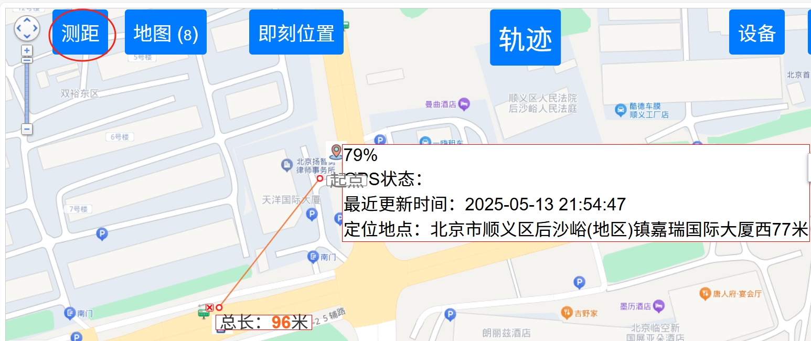
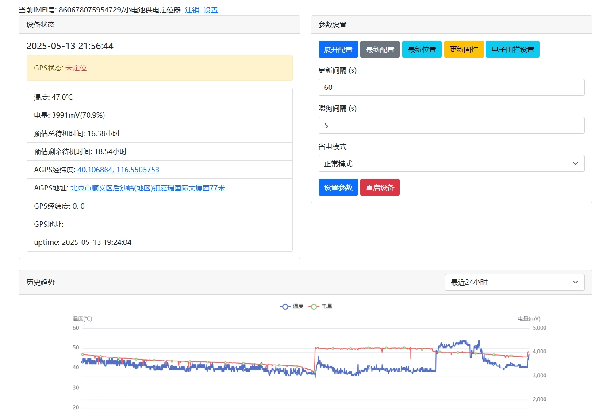
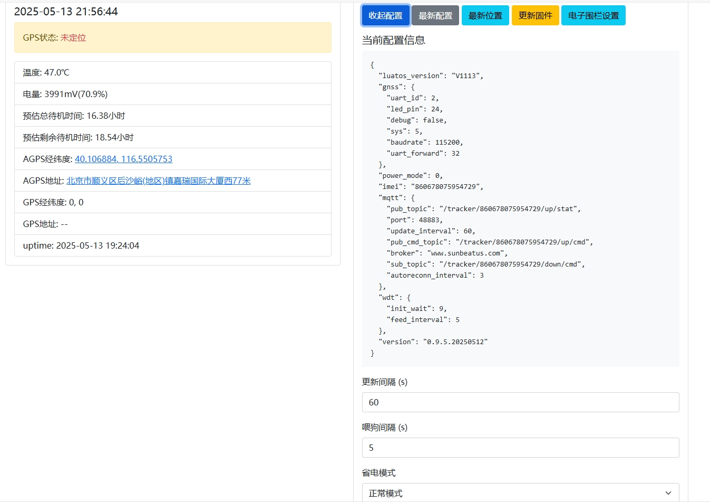

# 一、简述

本项目基于合宙Air780EG开发。Air780EG实时获得轨迹数据，并通过MQTT协议上传至服务器。  
服务器通过mqtt协议订阅air780eg的几个主题，并把air780eg上传的数据进行解析，  
然后将数据保存至sqlite3数据库中。  
用户访问web前端，选择时间段，点击查询，将时间段内数据进行查询，返回给前端。  
考虑到电脑和手机的访问，没有用app或者小程序，直接用的网页访问。  
建议电脑和手机端，都使用chrome/edge浏览器访问。  
目前我用了两种设备：  
- **给狗狗定位的定位器**  
是一个小模块+一个电池的，这个是封装到一个小盒子里面，给狗狗定位用的。  
成本合计在￥66.8+￥11.6=￥78.4。  
- **给汽车用的定位器**  
这个是U盘样子的，是直接插汽车上，给汽车定位的。  
成本是￥58.8
  

# 二、相关截图示例  

## 2.1 位置信息  
用户登录后，可以查看当前定位器的位置信息。   
  
点击“分享”按钮，分享当前位置信息。  
  
选择分享百度地图还是高德地图的链接，生成链接地址。  
    
将链接地址粘贴到微信或者浏览器中  
  

## 2.2 测距  
点击“测距”按钮，将会进入测距功能。


## 2.3 导航到定位器位置  
点击“导航”按钮，将会引导用户导航到定位器位置。
由于跨app调用，需要一些授权

选择打开外部应用后，可以进入百度地图进行导航


## 2.4 历史轨迹
点击“轨迹”按钮，可以选择时间范围，查看当前定位器的历史轨迹。  
  
  
点击“播放轨迹”按钮，播放轨迹。  
[播放轨迹视频](pics/play_his_tracks.mp4)  
点击“分享轨迹”按钮，分享轨迹。  
  

## 2.5 设备信息
点击“设备”按钮，查看当前定位器的设备信息。  
可以查看定位器的IMEI，设备描述，最近update时间，当前GPS坐标情况。工作的温度，电池状态等信息。    
也可以看到设备的配置参数信息。  
  

### 2.5.1 设备别名、手机、邮箱等信息设置  
点击“设置”按钮，进入设备别名、手机、邮箱等信息设置。  
  

### 2.5.2 展开配置查看详细参数  
点击“展开配置”按钮，查看详细参数。  
  

### 2.5.3 电子围栏设置  
点击“电子围栏设置”按钮，进入电子围栏设置。  
当定位器处于设定的任意一个电子围栏内时，不会触发告警。  
当定位器位于所有的围栏之外时，会触发告警。  
（告警的设置在2.5.1中设置）  

默认进入的概览模式，可以查看所有的围栏。  
可以选中具体某一个围栏，定位到这个围栏，查看详细信息。  
  
点击“添加电子围栏”按钮，进入围栏设置。
可以直接在地图上选点，也可以在地址栏中输入地址，然后点“搜索地址”，会自动定位到位置。给出对应的坐标。


# 三、 功能描述

## 3.1. Air780EG代码部分  

主要实现了以下功能：

- GNSS定位获取地理位置信息
- WiFi扫描获取周围无线网络信息 - 暂为
- MQTT协议通信实现数据上传和命令控制
- 电源管理实现不同省电模式
- 固件更新(FOTA)

### 程序流程

1. 设备启动，加载main.lua
2. 初始化系统组件和配置
3. 启动GNSS定位模块
4. 连接MQTT服务器
5. 定期采集设备状态和位置信息
6. 通过MQTT上报数据
7. 监听并处理来自云端的命令
8. 如有需要，执行固件更新或重启

### 特殊功能

#### 固件更新(FOTA)

- 支持通过MQTT接收固件更新命令
- 下载新固件
- 校验并应用更新
- 自动重启生效

#### 看门狗(WDT)

- 防止程序卡死
- 可配置初始化等待时间和喂狗间隔
- 自动定期喂狗

#### 配置管理

- 配置信息持久化存储
- 支持本地和远程配置修改
- 修改配置后自动保存并重启生效

### 日志记录

- 所有关键操作都有详细日志输出
- 包括定位状态变化、网络连接状态、命令执行等
- 有助于调试和故障排查

### 3.1.1 主要文件组成

```
IotDevice/
├── config.lua       # 配置文件，包含MQTT、GNSS等配置参数
├── main.lua         # 主程序入口文件
├── myGNSS.lua       # GNSS定位相关功能模块
├── myWIFI.lua       # WiFi扫描相关功能模块
└── myMQTT.lua       # MQTT通信核心功能模块
```

### 3.1.2 config.lua - 配置文件

该文件定义了设备的主要配置参数，包括：

- MQTT服务器连接信息（地址、端口、认证信息）
- 看门狗(WDT)配置
- GNSS模块配置（串口、波特率、定位系统选择）
- 设备版本信息

特点：
- 支持从存储中读取配置，保证配置持久化
- 提供默认配置，并在首次运行时写入存储
- 可以通过MQTT远程更新配置

### 3.1.3 main.lua - 主程序入口

作为程序入口，主要职责：

- 设置项目基本信息(名称、版本)
- 初始化系统库(sys, sysplus)
- 初始化日志记录
- 初始化存储(fskv)
- 初始化看门狗(watchdog)
- 加载配置(config)
- 启动GNSS模块(myGNSS)
- 初始化MQTT通信(myMQTT)

### 3.1.4 myGNSS.lua - GNSS定位模块

该模块实现了GNSS定位的所有功能：

#### 核心功能：

- 初始化GNSS串口通信
- 解析NMEA定位数据
- 处理AGPS辅助定位
- 管理定位状态
- 提供定位结果查询

#### 关键特性：

- 支持多种定位系统(GPS、北斗、GLONASS混合模式)
- 自动下载和更新星历数据
- 基站定位作为备用方案
- WiFi扫描结果作为辅助定位信息
- 提供信号质量监测
- 实现定位状态变化通知机制

#### 定位流程：

1. 初始化GNSS模块并启动定位
2. 尝试使用AGPS提高定位速度和精度
3. 监听定位状态变化事件
4. 在定位成功时保存位置信息
5. 在定位失败时尝试自动恢复

### 3.1.5 myWIFI.lua - WiFi扫描模块

该模块实现了WiFi网络扫描功能：

- 异步WiFi扫描
- 扫描结果处理
- 按信号强度排序
- 限制返回结果数量
- BSSID格式转换

特点：
- 使用wlan.scan()异步API实现非阻塞扫描
- 使用WLAN_SCAN_DONE消息通知扫描完成
- 返回前5个最强信号的WiFi网络信息
- 包含时间戳记录扫描时间
- 支持定时扫描机制

### 3.1.6 myMQTT.lua - MQTT通信模块

该模块是整个设备与云端通信的核心，实现了：

#### 连接管理：

- MQTT broker连接和认证
- 自动重连机制
- 心跳保持连接活跃
- 订阅命令主题

#### 数据上报：

- 设备状态信息采集(CSQ、RSSI、电池电压等)
- GNSS定位信息采集
- WiFi扫描结果
- 系统资源使用情况
- 上报间隔可配置

#### 命令处理：

- 接收云端指令并执行
- 支持的命令包括：
  * 更新上报间隔
  * 更新看门狗喂狗间隔
  * 请求状态报告
  * 设备重启
  * 获取当前配置
  * 设置新配置
  * 固件更新

#### 电源管理：

- 支持三种电源模式：
  * 正常模式
  * 低功耗模式
  * 极度省电模式
- 根据模式自动调整GPS和其他外设电源状态


## 3.2. 公网服务器部分

这部分部署在一个公网服务器上（自己的VPS，上面装mosquitto的MQTT服务器），用于做web前端展现以及后端监听mqtt的几个主题进行响应。

### 3.2.1 程序文件结构
```
PubServer/
├── air780eg.py          # 主程序，处理设备数据和Web请求
├── air_config.py         # 配置文件，包含MQTT、数据库等配置
├── Baidu.py              # 百度地图相关功能，包括坐标转换和地址解析
├── models.py             # 数据库模型定义
├── zip_data.py           # 数据压缩和历史轨迹生成
├── check_fence.py        # 电子围栏检查
├── gen_baidu_link.py     # 生成百度地图链接
├── battery_estimate.py   # 电池电量估算
├── alert.py              # 告警通知（短信、邮件、虾推）
├── templates/            # HTML模板
│   ├── baidu_templ.html
│   ├── dev.html
│   ├── history_templ.html
│   └── ...其他HTML模板...
└── static/               # 静态资源
    ├── css/
    ├── js/
    └── img/
```

### 3.2.2 程序逻辑说明

#### 3.2.2.1. `air780eg.py` - 主程序
这是整个系统的主入口，负责以下核心功能：
- 初始化Flask应用和SQLAlchemy数据库连接
- MQTT客户端初始化和消息处理
- 各种API路由的实现
- 用户认证和会话管理
- 数据可视化和地图展示

**主要模块功能：**
```python
# MQTT消息处理
def on_mqtt_connect(client, userdata, flags, rc): # MQTT连接成功后订阅主题
def on_mqtt_message(client, userdata, msg): # 处理MQTT消息，区分状态消息和命令消息
def save_to_db(data): # 将设备数据保存到数据库
def save_cfg_to_db(data): # 将设备配置保存到数据库

# Web API路由
@app.route('/dev') # 设备信息页面
@app.route('/api/data/realtime') # 获取实时数据
@app.route('/api/data/history') # 获取历史数据
@app.route('/api/data/GetDevicesHistory') # 获取设备历史数据
@app.route('/api/data/GetTracking') # 获取跟踪数据
@app.route('/api/config/get') # 获取设备配置
@app.route('/api/config/set') # 设置设备配置
@app.route('/api/address/get') # 获取地址信息
@app.route('/') # 首页，显示设备位置
@app.route('/his') # 历史轨迹页面
@app.route('/fence') # 电子围栏管理
@app.route('/api/geofence/add') # 添加电子围栏
@app.route('/api/geofence/delete') # 删除电子围栏
@app.route('/api/geofence/update') # 更新电子围栏
@app.route('/login') # 登录接口
@app.route('/logout') # 登出接口
@app.route('/change_password') # 修改密码
@app.route('/alert') # 告警设置页面
@app.route('/api/alert/get') # 获取告警设置
@app.route('/api/alert/update') # 更新告警设置
@app.route('/api/battery/estimate') # 电池电量估算
@app.route('/api/firmware/latest') # 获取最新固件信息
```


#### 3.2.2.2. `air_config.py` - 配置文件
包含系统运行所需的各种配置：
- MQTT服务器信息
- 数据库配置
- 百度地图AK
- 固件升级路径
- 告警设置
- 邮件服务器配置
- 短信服务配置
- 日志配置

#### 3.2.2.3. `Baidu.py` - 百度地图相关功能
提供百度地图集成所需的功能：
- 坐标系转换（WGS84 <-> GCJ02 <-> BD09）
- 地址解析（经纬度 -> 实际地址）
- WiFi和基站定位（未完全实现）

#### 3.2.2.4. `models.py` - 数据库模型
定义所有数据库表的模型：
- [IotData] - iot_data表，存储设备上传的数据
- [UrlMapping] - url_mapping表，短链接映射
- [IotCfg] - iot_cfg表，存储设备配置
- [User] - user表，用户信息
- [ZipData] - zip_data表,压缩后的设备数据
- [GeoFence]- geo_fence表，电子围栏数据
- [ShareTracker] - share_tracker表，轨迹分享数据

#### 3.2.2.5. zip_data.py - 数据压缩和历史轨迹
负责将原始设备数据进行压缩，生成便于查询的历史轨迹数据。包含两个主要功能：  
- [copy_and_filter_data(imei)]- 根据IMEI压缩数据  
- 模块级代码直接执行的部分 - 处理所有设备的历史数据  
```
比如7:10:00、7:15:00、7:20:00上报的数据都记录在了iot_data表中，位置停留不动时，其中的坐标没有变化，    
进行压缩时，只记录最后7:20:00时间的坐标记录到zip_data表中。
```

#### 3.2.2.6. check_fence.py - 电子围栏检查
定期检查设备是否超出预设的电子围栏范围，并在超出时发送告警通知。

#### 3.2.2.7. gen_baidu_link.py - 生成百度地图链接
提供生成百度地图链接的功能，包括：
- [generate_baidu_map_link(lat, lng, title, content)] - 生成百度地图链接
- [baidu_shorten_url(long_url)] - 使用第三方服务缩短URL

#### 3.2.2.8. [battery_estimate.py] - 电池电量估算
基于电压值估算电池剩余时间和百分比：
- 使用插值法根据电压值估算电池状态
- 提供示例用法演示不同电压下的估算结果

#### 3.2.2.9. `alert.py` - 告警通知
实现多种告警通知方式：
- [send_sms(phone_number, dev_id, address)] - 发送短信通知
- [send_email(email_address, message)] - 发送电子邮件通知
- [send_xiatui_alert(api_key, message)] - 发送虾推通知

#### 3.2.2.10. HTML模板 (`templates/`)
提供Web界面的HTML模板：
- [baidu_templ.html] - 主要地图显示页面
- [dev.html]- 设备信息页面
- [history_templ.html] - 历史轨迹页面
- [geo_fence.html] - 电子围栏管理页面
- [modify_geofence.html] - 电子围栏编辑页面
- [login_templ.html] - 登录页面
- [change_password_templ.html] - 修改密码页面
- [qrcode.html] - 二维码生成页面

#### 3.2.2.11. 静态资源 (`static/`)
包含前端所需的静态资源：
- [css/] - CSS样式表
- [js/] - JavaScript脚本
- [img] - 图片资源
- [firmware] - 固件更新文件

### 3.2.3 系统工作流程
1. **设备连接**：Air780EG设备通过MQTT协议连接服务器并上传数据
2. **数据存储**：接收到的数据被存储到SQLite数据库中
3. **数据压缩**：定期将原始数据压缩生成历史轨迹数据
4. **Web访问**：用户通过浏览器访问Web界面查看设备状态和历史轨迹
5. **设备控制**：用户可以通过Web界面发送命令给设备
6. **告警机制**：当设备超出电子围栏时触发告警
7. **安全认证**：用户需要登录才能访问敏感数据

### 3.2.4 特色功能
- **动态地图展示**：使用百度地图API实时展示设备位置
- **历史轨迹回放**：支持查看设备的历史移动轨迹
- **电子围栏**：可设置地理围栏并在设备越界时告警
- **多设备支持**：支持同时管理多个Air780EG设备
- **安全机制**：包含登录验证、密码修改等功能
- **远程控制**：可通过Web界面发送指令给设备
- **电池估算**：根据电压估算电池剩余时间和百分比
- **短链接生成**：方便分享设备位置和轨迹信息
